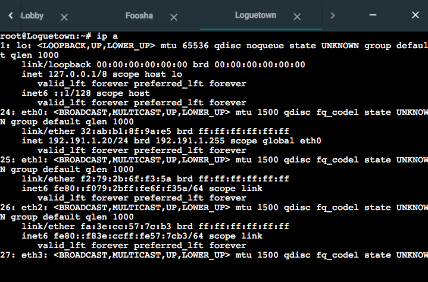
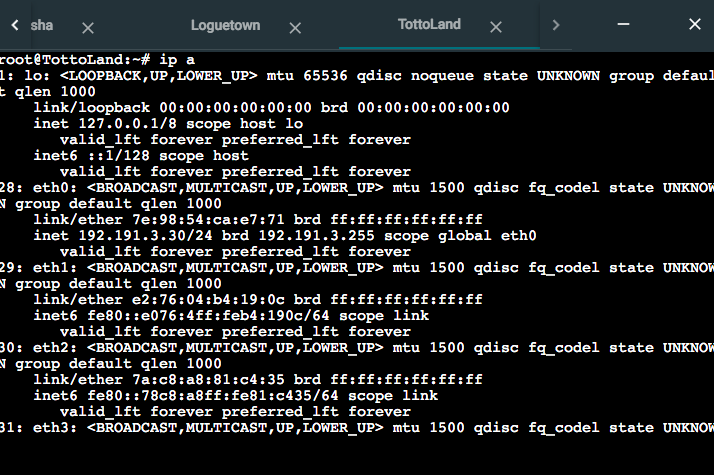
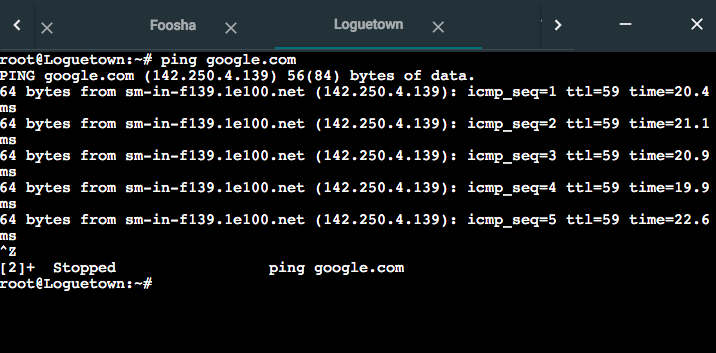
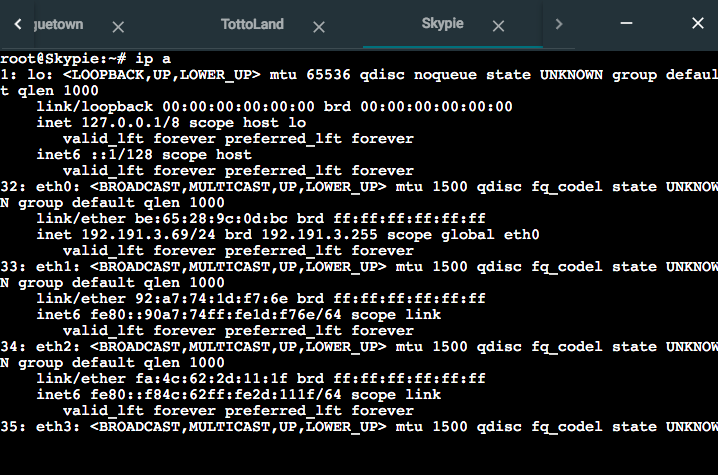

# Jarkom-Modul-3-C15-2021

# Nomor 1

EniesLobby sebagai DNS Server, Jipangu sebagai DHCP Server, Water7 sebagai Proxy Server

#### Langkah pengerjaan:

**EniesLobby**

- Pada file `script.sh` masukan isikan seperti berikut:

  ```
  echo nameserver 192.168.122.1 > /etc/resolv.conf

  apt-get update
  apt-get install bind9 -y
  apt-get install nano -y
  ```

**Jipangu**

- Pada file `script.sh` masukan isikan seperti berikut:

  ```
  echo nameserver 192.168.122.1 > /etc/resolv.conf

  apt-get update -y
  apt-get install isc-dhcp-server -y
  apt-get install nano -y
  ```

**Water 7**

- Pada file `script.sh` masukan isikan seperti berikut:

  ```
  echo nameserver 192.168.122.1 > /etc/resolv.conf

  apt-get update
  apt-get install squid -y
  apt-get install nano -y
  apt-get install apache2-utils -y
  ```

> Tidak ada screenshot karena soal hanya sekedar konfigurasi saja (tidak ada output)

# Nomor 2

Foosha sebagai DHCP Relay

#### Langkah pengerjaan:

- Pada `script.sh` isikan seperti berikut

  ```
  iptables -t nat -A POSTROUTING -o eth0 -j MASQUERADE -s 192.191.0.0/16

  apt-get update
  apt-get install isc-dhcp-relay -y
  apt-get install nano -y

  cat ./relay/isc-dhcp-relay.txt > /etc/default/isc-dhcp-relay
  service isc-dhcp-relay stop
  service isc-dhcp-relay start
  ```

- Buat file `./relay/isc-dhcp-relay.txt` dan isikan seperti berikut
  ```
  SERVERS="192.191.2.4"
  INTERFACES="eth1 eth2 eth3"
  ```

> Tidak ada screenshot karena soal hanya sekedar konfigurasi saja (tidak ada output)

# Nomor 3

Semua client yang ada HARUS menggunakan konfigurasi IP dari DHCP Server.
Client yang melalui Switch1 mendapatkan range IP dari [prefix IP].1.20 - [prefix IP].1.99 dan [prefix IP].1.150 - [prefix IP].1.169

#### Langkah pengerjaan:

**Loguetown, Alabasta**

- Buat file `./dhcp/interface.txt` berisikan
  ```
  auto eth0
  iface eth0 inet dhcp
  ```
- Tambahkan pada `script.sh` supaya isi file tersebut masuk ke `/etc/network/interfaces`
  ```
  cat dhcp/interfaces.txt > /etc/network/interfaces
  ```

**Jipangu**

- Buat file `./dhcp/dhcp.conf.txt` lalu isikan seperti berikut

  ```
  ddns-update-style none;
  option domain-name "example.org";
  option domain-name-servers ns1.example.org, ns2.example.org;

  default-lease-time 600;
  max-lease-time 7200;
  log-facility local7;
  subnet 192.191.1.0 netmask 255.255.255.0 {
     range 192.191.1.20 192.191.1.99;
     range 192.191.1.150 192.191.1.169;
     option routers 192.191.1.1;
     option broadcast-address 192.191.1.255;
     option domain-name-servers 202.46.129.2;
     default-lease-time 600;
     max-lease-time 7200;
  }

  subnet 192.191.2.0 netmask 255.255.255.0 {}
  ```

  - Buat file `./dhcp/isc-dhcp-server.txt` lalu isikan seperti berikut:

  ```
  INTERFACES="eth0"
  ```

- Tambahkan file berikut pada `script.sh`

  ```
  cat ./dhcp/isc-dhcp-server.txt > /etc/default/isc-dhcp-server
  cat ./dhcp/dhcpd.conf.txt > /etc/dhcp/dhcpd.conf
  service isc-dhcp-server stop
  service isc-dhcp-server start
  ```

- Jalankan `script.sh`



# Nomor 4

Client yang melalui Switch3 mendapatkan range IP dari [prefix IP].3.30 - [prefix IP].3.50

#### Langkah pengerjaan:

**Tottoland, Skypie**

- Buat file `./dhcp/interface.txt` berisikan
  ```
  auto eth0
  iface eth0 inet dhcp
  ```
- Tambahkan pada `script.sh` supaya isi file tersebut masuk ke `/etc/network/interfaces`
  ```
  cat dhcp/interfaces.txt > /etc/network/interfaces
  ```

**Jipangu**

- Pada file `./dhcp/dhcp.conf.txt` tambahkan seperti berikut

  ```
  subnet 192.191.3.0 netmask 255.255.255.0 {
     range 192.191.3.30 192.191.3.50;
     option routers 192.191.3.1;
     option broadcast-address 192.191.3.255;
     option domain-name-servers 202.46.129.2;
     default-lease-time 600;
     max-lease-time 7200;
  }
  ```

- Jalankan `script.sh`



# Nomor 5

Client mendapatkan DNS dari EniesLobby dan client dapat terhubung dengan internet melalui DNS tersebut.

#### Langkah pengerjaan:

**EniesLobby**

- Buat file `./dhcp/named.conf.options.txt` lalu isikan seperti berikut:

  ```
  options {
    directory "/var/cache/bind";

    forwarders {
     192.168.122.1;
    };

    allow-query{any;};

    auth-nxdomain no;    # conform to RFC1035
    listen-on-v6 { any; };
  };
  ```

- Pada `script.sh` tambahkan code berikut

  ```
  cat ./dhcp/named.conf.options > /etc/bind/named.conf.options
  ```

- Jalankan `script.sh`



# Nomor 6

Lama waktu DHCP server meminjamkan alamat IP kepada Client yang melalui Switch1 selama 6 menit sedangkan pada client yang melalui Switch3 selama 12 menit. Dengan waktu maksimal yang dialokasikan untuk peminjaman alamat IP selama 120 menit

### Langkah pengerjaan:

**Jipangu**

- Ubah konfigurasi subnet switch 1 (192.191.1.0) dan switch 3 (192.191.3.0) pada `./dhcp/dhcpd.conf.txt` menjadi

  ```
  subnet 192.191.1.0 netmask 255.255.255.0 {
     range 192.191.1.20 192.191.1.99;
     range 192.191.1.150 192.191.1.169;
     option routers 192.191.1.1;
     option broadcast-address 192.191.1.255;
     option domain-name-servers 202.46.129.2;
     default-lease-time 360;
     max-lease-time 7200;
  }

  subnet 192.191.3.0 netmask 255.255.255.0 {
     range 192.191.3.30 192.191.3.50;
     option routers 192.191.3.1;
     option broadcast-address 192.191.3.255;
     option domain-name-servers 202.46.129.2;
     default-lease-time 720;
     max-lease-time 7200;
  }
  ```

> Tidak ada screenshot karena soal hanya sekedar konfigurasi saja (tidak ada output)

# Nomor 7

Menjadikan Skypie sebagai server untuk jual beli kapal yang dimilikinya dengan alamat IP yang tetap dengan IP [prefix IP].3.69

### Langkah pengerjaan:

**Jipangu**

- Pada `./dhcp/dhcpd.conf.txt` tambahkan berikut
  ```
  host Skypie {
    hardware ethernet be:65:28:9c:0d:bc; #hardware address Skypie
    fixed-address 192.191.3.69;
  }
  ```

**Skypie**

- Pada `./dhcp/interfaces.txt` ubah isinya mejadi

  ```
  auto eth0
  iface eth0 inet dhcp
  hwaddress ether be:65:28:9c:0d:bc
  ```

- Jalankan `script.sh`



# Nomor 8

Pada Loguetown, proxy harus bisa diakses dengan nama `jualbelikapal.yyy.com` dengan port yang digunakan adalah 5000.

#### Langkah pengerjaan:

### Water7

- Install terlebih dahulu aplikasi **squid** dan **apache2-utils**
  ```
  apt-get install squid -y
  apt-get install apache2-utils -y
  ```
- Buat konfigurasi pada folder Squid
  ```
  vim /etc/squid/squid.conf
  ```
- Lakukan edit pada file tersebut seperti di bawah ini:


- Tambahkan juga IP EniesLobby pada `/etc/resolv.conf` seperti berikut:


- Restart squid dengan `service squid restart`

### Loguetown

- Install aplikasi **lynx**
  `apt-get install lynx -y`
- Aktifkan proxy dengan menambahkan syntax pada terminal

`export http_proxy="http://192.191.2.3:5000"`

- Buka `its.ac.id` dengan lynx


# Nomor 9

Agar transaksi jual beli lebih aman dan pengguna website ada dua orang, proxy dipasang autentikasi user proxy dengan enkripsi MD5 dengan dua username, yaitu `luffybelikapalyyy` dengan password `luffy_yyy` dan `zorobelikapalyyy` dengan password `zoro_yyy`.

#### Langkah pengerjaan:

### Water7

- Kita perlu membuat autentikasi baru untuk username `luffybelikapalc15` dan `zorobelikapalc15` dengan syntax seperti ini :

```
htpasswd -cm /etc/squid/passwd luffybelikapalc15
htpasswd -m /etc/squid/passwd zorobelikapalc15
```

`-cm` memiliki arti create new file dengan enkripsi MD5 dan `-m` untuk membuat user baru di file tersebut.

- Password untuk `luffybelikapalc15` adalah `luffy_c15`, serta `zorobelikapalc15` adalah `zoro_c15`

- Kita dapat cek apakah username & password sudah tersimpan pada `/etc/squid/passwd`.

- Edit file `squid.conf` pada `/etc/squid` menjadi:


- Jangan lupa untuk `service squid restart` untuk menggunakan konfigurasi yang baru.

### Loguetown

- Kembali export proxy dan lakukan command `lynx its.ac.id`
- Masukkan username & password sebagai berikut (contoh pada luffy) :


Hasil lynx :


# Nomor 10

Transaksi jual beli tidak dilakukan setiap hari, oleh karena itu akses internet dibatasi hanya dapat diakses setiap hari Senin-Kamis pukul 07.00-11.00 dan setiap hari Selasa-Jum’at pukul 17.00-03.00 keesokan harinya (sampai Sabtu pukul 03.00).

#### Langkah pengerjaan:

### Water7

- Buatlah pembatasan waktu akses transaksi jual beli pada file `acl.conf` di directory `/etc/squid`. Tambahkan sebagai berikut:


Syntax di atas berguna untuk menyesuaikan persyaratan yang diminta pada soal. Setiap `AVAILABLE_WORKING` menunjukkan waktu akses proxy yang dapat digunakan. `AVAILABLE_WORKING` menunjukkan pada hari Senin - Kamis pukul 07.00 - 11.00. `AVAILABLE_WORKING1` menunjukkan pada hari Selasa - Jumat pukul 17.00 - 24.00. `AVAILABLE_WORKING2` menunjukkan hari Rabu - Sabtu pukul 24.00 - 03.00.

- Edit juga file `squid.conf` di directory `/etc/squid` seperti di bawah ini:

```
http_port 5000
visible_hostname jualbelikapal.c15.com

auth_param basic program /usr/lib/squid/basic_ncsa_auth /etc/squid/passwd
auth_param basic children 5
auth_param basic realm Proxy
auth_param basic credentialsttl 2 hours
auth_param basic casesensitive on
acl USERS proxy_auth REQUIRED

include /etc/squid/acl.conf
http_access allow AVAILABLE_WORKING USERS
http_access allow AVAILABLE_WORKING1 USERS
http_access allow AVAILABLE_WORKING2 USERS
http_access deny all
```

- Restart kembali squid dengan `service squid restart`.

### Loguetown

- Export kembali proxy pada command dan set _date_ di Loguetown `date -s "10 NOV 2021 10:00"`. Lanjutkan dengan lynx ke situs `its.ac.id`.


Hasil lynx (situs bisa dikunjungi):


- Coba juga apabila _date_-nya diubah ke jadwal yang tidak bisa diakses. Contoh tuliskan command `date -s "10 NOV 2021 12:00"`. Lanjutkan dengan lynx ke situs `its.ac.id`.


Hasil lynx (situs tidak bisa dikunjungi):


# Nomor 11

Agar transaksi bisa lebih fokus berjalan, maka dilakukan redirect website agar mudah mengingat website transaksi jual beli kapal. Setiap mengakses google.com, akan diredirect menuju `super.franky.yyy.com` dengan website yang sama pada soal shift modul 2. Web server `super.franky.yyy.com` berada pada node Skypie.

#### Langkah pengerjaan:

### EniesLobby

- Edit file `/etc/bind/named.conf.local` seperti pada gambar berikut:


- Buat folder baru bernama `kaizoku` pada direktori `/etc/bind` dengan command `mkdir /etc/bind/kaizoku`.

- Copy juga file `db.local` yang ada pada `/et/bind` ke dalam folder kaizoku, dan ubah namanya menjadi `super.franky.c15.com`

```
cp /etc/bind/db.local /etc/bind/kaizoku/super.franky.c15.com
```

- Edit file yang baru di-copy tadi sebagai berikut :


- Jangan lupa untuk restart bind9 dengan command `service bind9 restart`.

### Skypie

- Copy file `000-default.conf` yang ada pada `sites-available` ke file `super.franky.c15.com.conf` dengan command :

```
cp /etc/apache2/sites-available/000-default.conf /etc/apache2/sites-available/super.franky.c15.com.conf`
```

- Lakukan edit pada file `super.franky.c15.com.conf` menjadi :


- Aktifkan konfigurasi dengan `a2ensite super.franky.c15.com` serta restart apache `service apache2 restart`.

- Ketik `cd` dan pindah ke directory `/var/www` dengan command `cd /var/www`.

- Download file zip dengan command :

```
wget https://github.com/FeinardSlim/Praktikum-Modul-2-Jarkom/raw/main/super.franky.zip
```

serta lakukan unzip `unzip super.franky.zip`

- Pindahkan file `error` & `public` ke `super.franky.c15.com` seperti berikut :

```
cp -r /root/super.franky/error /var/www/super.franky.E08.com
cp -r /root/super.franky/public /var/www/super.franky.E08.com
```

### Water7

- Kembali ke file `/etc/squid/squid.conf` dan tambahkan sebagai berikut:

```
acl BLACKLIST dstdomain .google.com
deny_info http://super.franky.c15.com/ BLACKLIST
http_access deny AVAILABLE_WORKING BLACKLIST
```

dan jalankan command `service squid restart` untuk menggunakan konfigurasi squid yang baru.

### Loguetown

Berikut hasil `lynx google.com` yang akan melakukan _redirect_ menuju `super.franky.c15.com`:


# Nomor 12
Saatnya berlayar! Luffy dan Zoro akhirnya memutuskan untuk berlayar untuk mencari harta karun di super.franky.yyy.com. Tugas pencarian dibagi menjadi dua misi, Luffy bertugas untuk mendapatkan gambar (.png, .jpg), sedangkan Zoro mendapatkan sisanya. Karena Luffy orangnya sangat teliti untuk mencari harta karun, ketika ia berhasil mendapatkan gambar, ia mendapatkan gambar dan melihatnya dengan kecepatan 10 kbps (12)

#### Langkah pengerjaan :

### Water7
- Buat file `ext.txt` dengan isian seperti gambar, pada direktori `/etc/squid/ext.txt`
  

- Kemudian tambahkan config pada file `/etc/squid/squid.conf`
  ```    delay_pools 1
    delay_class 1 1
    delay_parameters 1 1250/1250
    delay_access 1 allow luffy
    delay_access 1 deny all
   ```
    
- Restart squid dengan `service squid restart` 

### Loguetown
- Buka `super.franky.c15.com` dengan `lynx` dan download file `background-frank.jpg`

  
  
  
    
  terlihat pada gambar diatas download file dibatasi dengan kecepatan download 10kbps

# Nomor 13
Sedangkan, Zoro yang sangat bersemangat untuk mencari harta karun, sehingga kecepatan kapal Zoro tidak dibatasi ketika sudah mendapatkan harta yang diinginkannya (13).

#### Langkah Pengerjaan

### Water7
- Buka file config `/etc/squid/squid.conf`
- tambahkan config tersebut dengan config 

  ```acl USER1 proxy_auth luffybelikapalc15
     acl USER2 proxy_auth zorobelikapalc15
     acl BLACKLIST dstdomain .google.com
     acl ext_block url_regex "/etc/squid/ext.txt"

     delay_pools 2
     delay_class 1 1
     delay_parameters 1 1250/1250
     delay_access 1 allow luffy
     delay_access 1 deny all
     delay_class 2 1
     delay_parameters 2 none
     delay_access 2 allow !luffy
  ```
- Kemudian restart squid `service squid restart`
  
### Loguetown
- jalankan perintah `export http_proxy="http://jualbelikapalc15.com:5000"`
- Buka `super.franky.c15.com` dengan `lynx`
- Download salah satu file dari laman tersebut
  
  

# Nomor 12
Saatnya berlayar! Luffy dan Zoro akhirnya memutuskan untuk berlayar untuk mencari harta karun di super.franky.yyy.com. Tugas pencarian dibagi menjadi dua misi, Luffy bertugas untuk mendapatkan gambar (.png, .jpg), sedangkan Zoro mendapatkan sisanya. Karena Luffy orangnya sangat teliti untuk mencari harta karun, ketika ia berhasil mendapatkan gambar, ia mendapatkan gambar dan melihatnya dengan kecepatan 10 kbps (12)

#### Langkah pengerjaan :

### Water7
- Buat file `ext.txt` dengan isian seperti gambar, pada direktori `/etc/squid/ext.txt`

  

- Kemudian tambahkan config pada file `/etc/squid/squid.conf`
  ```
  delay_pools 1
  delay_class 1 1
  delay_parameters 1 1250/1250
  delay_access 1 allow luffy
  delay_access 1 deny all
  ```
    
- Restart squid dengan `service squid restart` 

### Loguetown
- Buka `super.franky.c15.com` dengan `lynx` dan download file `background-frank.jpg`

  
  
  
    
  terlihat pada gambar diatas download file dibatasi dengan kecepatan download 10kbps

# Nomor 13
Sedangkan, Zoro yang sangat bersemangat untuk mencari harta karun, sehingga kecepatan kapal Zoro tidak dibatasi ketika sudah mendapatkan harta yang diinginkannya (13).

#### Langkah Pengerjaan

### Water7
- Buka file config `/etc/squid/squid.conf`
- tambahkan config tersebut dengan config 

  ```acl USER1 proxy_auth luffybelikapalc15
     acl USER2 proxy_auth zorobelikapalc15
     acl BLACKLIST dstdomain .google.com
     acl ext_block url_regex "/etc/squid/ext.txt"

     delay_pools 2
     delay_class 1 1
     delay_parameters 1 1250/1250
     delay_access 1 allow luffy
     delay_access 1 deny all
     delay_class 2 1
     delay_parameters 2 none
     delay_access 2 allow !luffy
  ```
- Kemudian restart squid `service squid restart`
  
### Loguetown
- jalankan perintah `export http_proxy="http://jualbelikapalc15.com:5000"`
- Buka `super.franky.c15.com` dengan `lynx`
- Download salah satu file dari laman tersebut
  
  
`
